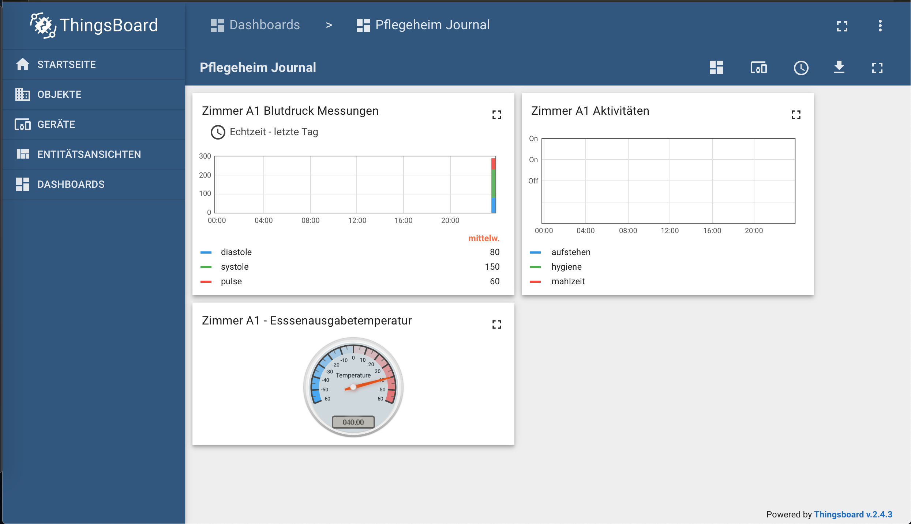

# IOT Pflegeheim
This repository contains documentation, software and hardware description to increase the efficiency of Nurse Homes (Pflegeheim)
through reduction of the manual effort required to document the activities of the Nurseplan (Pflegeplan).
This is achieved by
- IOT technology that automatically loads activity into a central database
- IOT reporting that automatically generates reports / views for different purposes

The initial scope addresses following activities:
- Wake up support ( yes / no )
- Measurement of blood pressure (Pulse, Systole, Diastole )
- Morning hygienic support ( yes / no )
- Breakfast
  - Quality       ( Temperature of the food when delivered)
  - Amount consumed (Ampelverfahren) 

# Components

## Hardware
- IOT Button (ESP8266 based)  used for registering suppport tasks and the Amount of breakfast consumed
- IOT Thermometer for collecting and registering the Breakfast quality
- IOT Blood Pressure device
- IOT Edge (Raspberry PI) is used to collect the information from the devices and transmit it to the central database. This is needed in order to ensure that no message went lost in case of intermittent storage. Finally, it provides an on-site visualisation capability in order to address lack of internet access.

## Software
- Embedded Device software is implemented in C++ using Arduino IDE, has the role of collecting the data from the sensor, 
  digitally sign it, generate a payload in the FHIR format, send it to the IOT Gateway.
- IOT Thingsboard.io 

## History
This work started by participating at the hackaton #CAREhacktCORONA,  the problem statement has been given by Markus, an experienced Pflegeheimleiter. The vision behind this work has been published as https://devpost.com/software/pflegeheim-burokratie-mehr-zeit-mit-bewohner-innen in the  hackaton https://carehacktcorona.devpost.com #CAREhacktCORONA.

